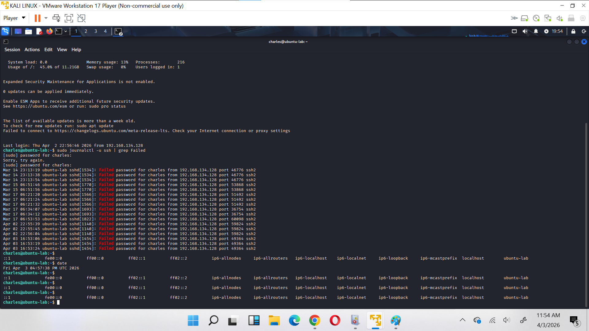
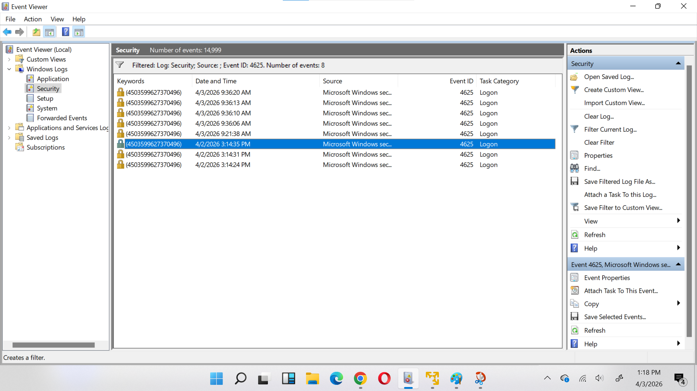

# log-analysis-lab
Windows and linux log analysis project simulating failed login detection
# 🔐 Windows & Linux Log Analysis Lab

## 📌 Project Overview
This project simulates a SOC (Security Operations Center) scenario where failed login attempts are detected and analyzed using both Linux and Windows systems.

---

## 🧰 Tools Used
- Ubuntu Server (Linux)
- Windows OS
- Event Viewer
- journalctl / auth.log

---

## 🐧 Linux Log Analysis

### Objective:
Detect failed SSH login attempts

### Commands Used:
```bash
sudo journalctl -u ssh | grep -i "failed"
sudo cat /var/log/auth.log | grep -i "failed"

### 📸 Evidence:



## 🪟 Windows Log Analysis

### Objective:
Detect failed login attempts using Event Viewer

### Steps:
- Open Event Viewer (eventvwr)
- Navigate to Windows Logs → Security
- Filter for Event ID 4625 (failed login)

### 📸 Evidence:


## key findings
- Failed login attemps were detected  on both linux and windows systems
- Linux logs showed repeated ssh authentication failures
- windows Event Viewer revealed Event ID 4625 (failed logins)
- These events indicate potential unauthorized access attemps

conclusion:
This project demonstrates how security analysts can monitor and investigate failed login attempts across multiple operating sytem using systems log.


